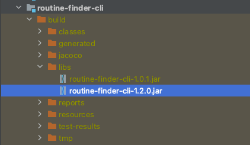

# Routine Finder Service

[](https://jenkins.dr-sturm.e2x.com/job/dbs-service-routine-finder-publish/)

This service allows customers to find a routine bespoke to their needs.

### Reference Documentation

For further reference of libraries and framework used within this project, please consider the following sections:

* [Official Gradle documentation](https://docs.gradle.org)
* [Spring Boot Gradle Plugin Reference Guide](https://docs.spring.io/spring-boot/docs/2.4.1/gradle-plugin/reference/html/)
* [Spring Configuration Processor](https://docs.spring.io/spring-boot/docs/2.4.1/reference/htmlsingle/#configuration-metadata-annotation-processor)
* [Spring Web](https://docs.spring.io/spring-boot/docs/2.4.1/reference/htmlsingle/#boot-features-developing-web-applications)
* [Open API 3.0](https://swagger.io/specification/)

# Setup

N/A

## Guides

### Development

All API endpoints are documented using [OpenAPI 3.0](https://swagger.io/specification/).

It is your responsibility to maintain this documentation: [openapi.yaml](./authentication-provider-service/src/main/resources/static/swagger-apis/v1/openapi.yaml).

When this service is started, the open api documentation can be viewed [here](http://localhost:8080/api/swagger-ui/index.html).

### Testing Guidelines

- All API endpoints must be verified against its OpenAPI spec.
- API endpoint under tests must be declared with one trait per endpoint (see [API Test Guidelines](./authentication-provider-service/documentation/api-test.md)).
- data models should have a factory providing a default instance with a capability to override the default values.
- Integration with external systems should be stubbed using Wiremock (see [Stubbing Guidelines](./authentication-provider-service/documentation/stubbing.md))
- Performance Tests 

### Performance Tests

Gatling will be used to execute simulations against a running instance of RFS. 

> ./gradlew routine-finder-service:gatlingRun

The above will execute the simulation scenarios found in the gatling source set.

Check Gatling documentation for more information.

#### *** Be aware, running load tests can incur costs if you exceed the daly usage limits
#### *** Be sure to check if costs are incurred after each run

## Configuration

### Question Definition

Routine Finder Service provides a mechanism to configure question for the following properties:

- question text
- question option text
- max allowed answers for a question

The following properties must be configured in the resources/messages/question.properties file:

```properties
age.text=How old are you?
age.option.18-25.text=Between 18 and 25 years old?
age.max-allowed-answers=2
```

*note: question with spaces must be replaced with a '-'*

### Sku Definition

Routine Graph contains products by name (or code). A sku definition entry must be provided to map the product to its sku id.

Sku definitions can be found in a file located at resources/messages/sku-definition.properties.

example of a sku definition entry:
```properties
body-cream.sku-id=08-100-BOD
```


## Project Structure

>routine-finder-service
> 
>REST API service responsible for finding whether a question or routine should be returned to a client.  

>routine-finder-enquiry
>
>Graph library representing complex decision tree which determines whether a question or routine should be returned.

>routine-finder-antlr
> 
>Bespoke language grammar for condition expression used in graph library  

>routine-finder-cli
>
>Routine Finder Command Line Tool to:
> importing graph configuration from an external source.
> validate imported configuration.

>routine-finder-data
> 
> Data access library containing repositories for graph, definitions etc.


## How To...

### Import a graph

Very shrewd process....

- checkout repository
- build import jar

```bash
./gradlew routine-finder-cli:build
```

- read the import command help:

```bash
java -jar ./routine-finder-cli/build/libs/routine-finder-cli-<version>.jar help
```

Version
- remember to put the correct version and the file path
- you can check the build/libs folder of routine-finder-cli to see which is the version it has built (always use the latest)
  
- execute the import 
```bash
java -jar ./routine-finder-cli/build/libs/routine-finder-cli-<VERSION>.jar import <FILE> routine-enquiry-graph-sandbox false
```

```bash
java -jar ./routine-finder-cli/build/libs/routine-finder-cli-1.2.0.jar import ./import.json routine-enquiry-graph-sandbox false
```

Version
- check the build/libs folder 
  
BucketName
- routine-enquiry-graph-sandbox


*note: to access the specified bucket (routine-enquiry-graph-sandbox in the example) the environment variable
GOOGLE_APPLICATION_CREDENTIALS has to be set, pointing to the correct google key file*


### Verify an imported graph
example
```
java -jar  ./routine-finder-cli/build/libs/routine-finder-cli-<version>.jar verify <bucketName> <routineFinderServiceUrl> <boolean> <csvFileName>
```
To speed things up.... increase the jvm memory.....: 
 java  -Xmx2G -jar  ./routine-finder-cli/build/libs/routine-finder-cli-<version>.jar verify <bucketName> <routineFinderServiceUrl> <boolean> <csvFileName>

```
java -Xmx2G -jar  ./routine-finder-cli/build/libs/routine-finder-cli-1.2.0.jar verify routine-enquiry-graph-sandbox https://routine-finder-service-dot-dr-sturm-qa.nw.r.appspot.com/api true verifyRF.csv
```

OPTIONS:
version 
- check the build/libs folder 

|bucketName|routineFinderServiceUrl|
|---|---|
|routine-enquiry-graph-sandbox |https://routine-finder-service-dot-dr-sturm-sandbox.nw.r.appspot.com|  


Note - if you need to change anything in the repository you will need rebuild the routine-finder-cli
`./gradlew routine-finder-cli:build`


### Add a new question

- add a new question entry in the question properties file
- add all question options in the question properties file
- configure question as a custom attribute on customers in the authentication provider service (
  dbs/authenticationprovider)


java -jar  ./routine-finder-cli/build/libs/routine-finder-cli-1.2.0.jar verify routine-enquiry-graph https://routine-finder-service-dot-dr-sturm-qa.nw.r.appspot.com/api true paths
